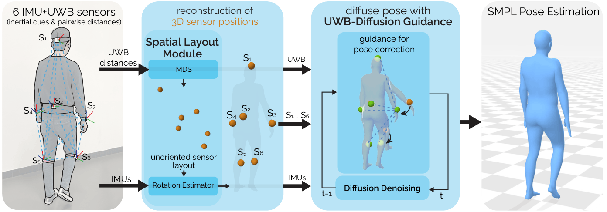

<div align="center">

<h1>Ultra Diffusion Poser: Diffusion-Based Human Motion Tracking from Sparse Inertial Sensors and Ranging-based Between-sensor Distances (CVPR 2026)</h1>

<p>
	Dominik Hollidt, Tommaso Bendinelli, <a href="https://www.christianholz.net">Christian Holz</a><br>
	<a href="https://siplab.org">Sensing, Interaction & Perception Lab</a>, Department of Computer Science, ETH Zürich, Switzerland<br>
	<a href="https://siplab.org/projects/UltraDiffusionPoser">Project Page</a>
</p>

</div>

## Abstract

Methods using inertial measurement units (IMUs) provide a wearable alternative to camera-based motion capture.
To mitigate drift from inertial signals, recent sparse inertial pose estimators integrate inter-sensor distances measured by ultra-wideband (UWB) ranging.
So far, UWB distances have only been used as an additional input feature, ignoring the physical constraints they impose on sensor positions.
However, these distances can also be used to reconstruct the underlying 3D sensor layout, which in turn provides more informative input for pose reconstruction.
We propose Ultra Diffusion Poser, a diffusion model that explicitly models these geometric constraints.
It includes a Spatial Layout Module that analytically reconstructs the 3D sensor positions from UWB measurements.
These sensor positions are used alongside IMU signals and UWB distances as a conditioning signal during diffusion.
Still, network predictions can violate inter-sensor distance measurements.
To address this, we introduce UWB-Diffusion Guidance, which encourages alignment between predicted poses and measured distances during diffusion sampling.
Together, these contributions enable our model to achieve state-of-the-art performance, reducing joint position error by up to 22\% over prior work.

<p align="center">
	
</p>

## Citation

```bibtex
@inproceedings{hollidt2026ultra,
	title={Ultra Diffusion Poser: Diffusion-Based Human Motion Tracking from Sparse Inertial Sensors and Ranging-based Between-sensor Distances},
	author={Hollidt, Dominik and Bendinelli, Tommaso and Holz, Christian},
	booktitle={Proceedings of the IEEE/CVF Conference on Computer Vision and Pattern Recognition},
	pages={7036--7046},
	year={2026}
}
```

## Setup

## 1. Install (conda env + PyTorch + rbdl)

Creates the conda environment, installs the pinned Python dependencies, and clones
and compiles rbdl with Python bindings against the env interpreter. The installation of the environment requires conda.

```bash
./install.sh            # ./install.sh --no-rbdl to skip the physics build
conda activate UDP      # the env install.sh creates
```

Details / options: see `requirements.txt` and `./install.sh --help`.

## 2. Download data + model weights

Each downloader asks before fetching and tells you which `config.py` path to set if
you already have the data. Accounts needed: SMPL, DIP (also covers TotalCapture GT),
AMASS, and cvssp (TotalCapture IMU).

```bash
./data_preprocessing/download_all.sh
# or individually:
#   download_smpl.sh   download_amass.sh   download_dip.sh
#   download_tc.sh     download_uip.sh     download_gip.sh
#   download_checkpoints.sh
```

Released model weights land in `data/checkpoints/<name>/`. Details: `data_preprocessing/README.md`.

## 3. Process the raw data

Synthesizes the AMASS training data and builds the cached `.pt` test sets under
`data/processed_data/` that the datasets/evaluator consume. Edit the `__main__`
block of the script to choose which datasets to (re)generate.

```bash
python modules/dataset/preprocess.py
```

## 4. (optional) Train

Pretrains the shared AMASS backbones once and reuses them for the finetunes.

```bash
./train_scripts/train_all.sh
# or: train_amass.sh, train_amass_noisy.sh, train_dip.sh, train_uip_ft.sh, train_gip_ft.sh
```

Details: `train_scripts/README.md`.

## 5. Evaluate

Loads the released checkpoint for each dataset and writes metrics to
`output/evaluation_res_UDP/`.

```bash
./eval_scripts/eval_all.sh
# or: eval_dancedb.sh, eval_tc.sh, eval_dip.sh, eval_uip.sh, eval_gip.sh, eval_uip_ft.sh, eval_gip_ft.sh
```

Details: `eval_scripts/README.md`.

## 6. Visualize results

Evaluating writes per-sequence predictions to
`data/result/<dataset>/UDP<exp_name>/<seq_id>.pt` and the matching ground truth to
`data/result/<dataset>/gt/<seq_id>.pt` (`<dataset>` is the basename of the eval
`data_dir`, e.g. `TotalCapture`, `SIGGRAPH_dataset`, `Multi-UWB-Merged`, `DIP`,
`test_split`; `<exp_name>` is the eval script's name, e.g. `tc`, `uipdb`, `gipdb`).
`visualizer/visualize_result.py` renders these in an interactive
[aitviewer](https://github.com/eth-ait/aitviewer) window.

It needs a display (it opens a window) and the SMPL body model; point
`SMPLX_MODEL_PATH` at the same `.pkl` used for everything else (defaults to
`data/smpl_m_lbs_10_207_0_v1.0.0.pkl`).

```bash
export SMPLX_MODEL_PATH="$PWD/data/smpl_m_lbs_10_207_0_v1.0.0.pkl"

# Ground truth (green) next to a prediction, colored by per-vertex error.
# Pass directories (ground truth first, then one or more prediction dirs); the
# script appends "<seq_id>.pt" to each. --seq_id picks which sequence to show.
python visualizer/visualize_result.py --show_gt --seq_id 10 \
  --seq_res_paths data/result/TotalCapture/gt data/result/TotalCapture/UDPtc

# Just play one or more prediction sequences (no ground truth, no error coloring):
python visualizer/visualize_result.py --seq_id 10 \
  --seq_res_paths data/result/TotalCapture/UDPtc
```

Useful flags: `--no_translation` pins the root in place (ignore global
translation); `--no_root_rotation` borrows the ground-truth root orientation for
predictions;
